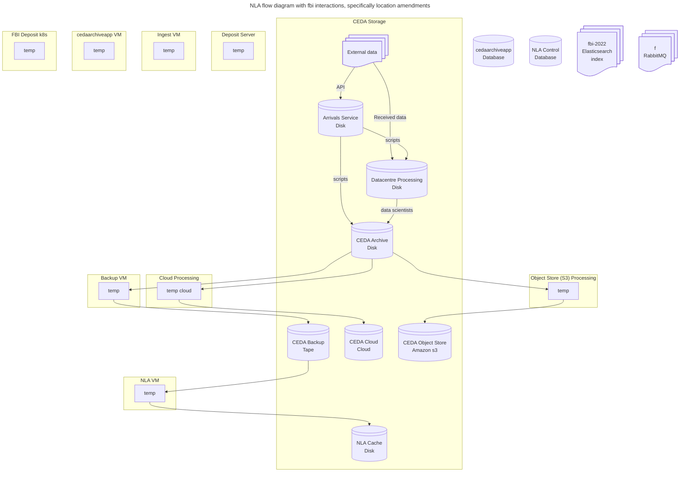

```mermaid
---
title: NLA flow diagram with fbi interactions, specifically location amendments
---

graph TB
%% Disks
external_data@{ shape: docs, label: "External data" }
arrivals_service@{ shape: lin-cyl, label: "Arrivals Service \n Disk" }
data_processing@{ shape: lin-cyl, label: "Datacentre Processing \n Disk" }
CEDA_archive@{ shape: lin-cyl, label: "CEDA Archive \n Disk" }
tape_archive@{ shape: lin-cyl, label: "CEDA Backup \n Tape" }
cloud@{ shape: lin-cyl, label: "CEDA Cloud \n Cloud" }
s3@{ shape: lin-cyl, label: "CEDA Object Store \n Amazon s3" }
nla_cache@{ shape: lin-cyl, label: "NLA Cache \n Disk" }


%% Databases
archiveapp_db@{ shape: cyl, label: "cedaarchiveapp \n Database" }
nla_control_db@{ shape: cyl, label: "NLA Control \n Database" }

%% Elasticsearch / RabbitMQ
fbi_index@{ shape: docs, label: "fbi-2022 \n Elasticsearch \n index" }
rabbit_deposit@{ shape: docs, label: "f \n RabbitMQ" }

%% Processes (inc repository where necessary)
temp@{ shape: rect, label: "temp" }
temp2@{ shape: rect, label: "temp" }
temp3@{ shape: rect, label: "temp" }
temp4@{ shape: rect, label: "temp" }
temp5@{ shape: rect, label: "temp" }
temp6@{ shape: rect, label: "temp" }
temp7@{ shape: rect, label: "temp cloud" }
temp8@{ shape: rect, label: "temp" }

%%Flowchart general
%% Archive to tape
CEDA_archive --> temp6
temp6 --> tape_archive

%% Archive to cloud
CEDA_archive --> temp7
temp7 --> cloud

%% Tape to NLA_cache
tape_archive --> temp4
temp4 --> nla_cache

%% Archive to ObjectStore
CEDA_archive --> temp8
temp8 --> s3


%% Flowchart storage
subgraph storage[CEDA Storage]
external_data -- "API" --> arrivals_service
external_data -- "Received data" --> data_processing
arrivals_service -- "scripts" --> CEDA_archive
arrivals_service -- "scripts" --> data_processing
data_processing -- "data scientists" --> CEDA_archive
tape_archive
cloud
s3
nla_cache
end


%% Servers/ k8s (need subgraphs for each of these with processes within them)
subgraph deposit_server[Deposit Server]
temp
end

subgraph ingest_machine[Ingest VM]
temp2
end

subgraph ceda_aa[cedaarchiveapp VM]
temp3
end

subgraph nla_vm[NLA VM]
temp4
end

subgraph fbi_deposit[FBI Deposit k8s]
temp5
end

subgraph backup[Backup VM]
temp6
end

subgraph cloud_processing[Cloud Processing]
temp7
end

subgraph s3_processing["Object Store (S3) Processing"]
temp8
end


```